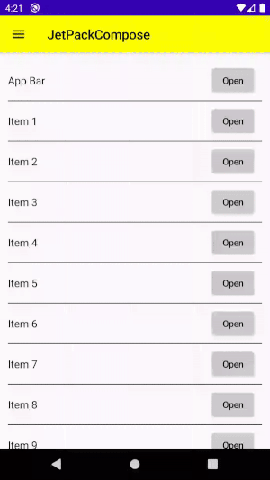

# JetPack-Compose

In Google IO '19, Google launched Jetpack Compose aims to be a declarative framework to build Android user interfaces easily using a Kotlin. So, basically, declarative UI means to create UI by specifying a specific set of UI elements.

This repository is a collection of jetpack compose modules to help bootstrap an Android Application.

|   | Name  | Description  |   |   |
| ------------| ------------ | ------------ | ------------ | ------------ |
| 1  | [TextView](https://github.com/yash786agg/JetPack-Compose/blob/master/app/src/main/java/com/app/uiComponents/TextView.kt) | TextView helps to display the text on screen.  |   |   |
| 2  | [AppBar](https://github.com/yash786agg/JetPack-Compose/blob/master/app/src/main/java/com/app/uiComponents/AppBar.kt) | AppBar component is often used as the header for our screen. It displays navigation title, color, icon along with menu components and clicks listener.  |   |   |
| 3  | [ListView](https://github.com/yash786agg/JetPack-Compose/blob/master/app/src/main/java/com/app/uiComponents/ListView.kt)  | It creates a column and stack all of them in listview vertically and inside this VerticalScroller help column in the scrolling of the list items. |   |   |

#### Jetpack Compose still isn’t ready for production. Developer preview libraries were made only to simplify trying the future of UI in Android.So you should be on 4.1 Canary build of Android Studio

### Step 01. Project's gradle file

    allprojects {
        repositories {
            google()
            jcenter()
        }
    }
    
    dependencies {
    classpath "com.android.tools.build:gradle:4.1.0-alpha01"
    classpath "org.jetbrains.kotlin:kotlin-gradle-plugin:1.3.61"
    }
    
### Step 02. App's build.gradle

    android 
    {
        // Set both the Java and Kotlin compilers to target Java 8.
        compileOptions {
            sourceCompatibility JavaVersion.VERSION_1_8
            targetCompatibility JavaVersion.VERSION_1_8
        }
        kotlinOptions {
            jvmTarget = '1.8'
        }
        buildFeatures {
            // Enables JetPack Compose for this module
            compose true
        }
    }
    
### When importing classes related to Jetpack Compose in this project, use those from:

* androidx.compose.* for compiler and runtime classes.
* androidx.ui.* for ui toolkit and libraries.
   
 ### UI components
 
    implementation 'androidx.ui:ui-layout:0.1.0-dev03'
    implementation 'androidx.ui:ui-material:0.1.0-dev03'
    implementation 'androidx.ui:ui-tooling:0.1.0-dev03'
    implementation 'androidx.ui:ui-foundation:0.1.0-dev03'
    implementation 'androidx.ui:ui-animation:0.1.0-dev03'
    implementation 'androidx.ui:ui-animation-core:0.1.0-dev03'
    implementation 'androidx.ui:ui-vector:0.1.0-dev03'
    implementation 'androidx.ui:ui-foundation:0.1.0-dev03'
    implementation 'androidx.ui:ui-text:0.1.0-dev03'
    implementation 'androidx.ui:ui-test:0.1.0-dev03'
    
# Demo

## Build it

You can [build and run](https://developer.android.com/studio/run) the project using the Android
Studio/Gradle. You need an android [emulator](https://developer.android.com/studio/run/emulator)
or a [real device](https://developer.android.com/studio/run/device) to test the build.

# Prerequisites
* __Android Studio 4.1 Canary 1__
* __Gradle version 4.1.0-alpha01__
* __Kotlin version 1.3.61__
* __Android Device with USB Debugging Enabled__

# Built With

* __[Android Studio Preview](https://developer.android.com/studio/preview)__ - The Official IDE for Android
* __[Kotlin](https://developer.android.com/kotlin)__ - Language used to build the application
* __[Gradle](https://gradle.org)__ - Build tool for Android Studio

Thanks for reading this repo. Be sure to click ★ below to recommend this repo if you found it helpful. It means a lot to me.

For more about programming, follow me on [Medium](https://medium.com/@yash786agg)

Also, Let’s become friends on [Linkedin](http://bit.ly/24t4EVI)    
 
